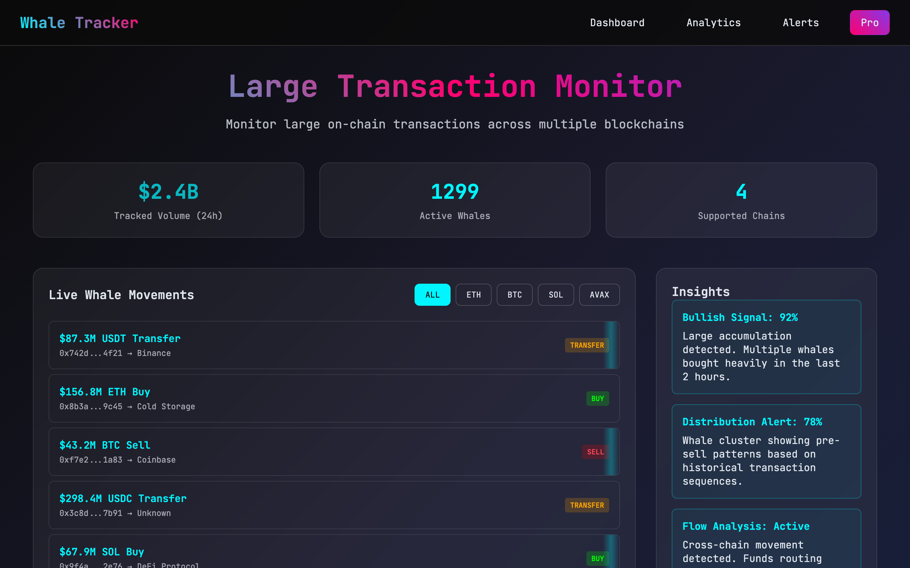

<div align="center">

# Whale Tracker

### A polished whale-watching dashboard, live in an afternoon.

&nbsp;
&nbsp;


</div>

<div align="center"></div>

---

Whale Tracker is a self-hostable, single-page dashboard front-end that displays a live-updating feed of large ("whale") on-chain transactions. The entire UI is built and animated; you rebrand it from one config file and wire your own on-chain data provider behind a small three-method adapter. Until you do, it runs fully on built-in simulated data — the complete experience, with zero setup, zero keys, and zero backend.

It's for crypto/web3 builders, trading desks, DAO-treasury teams, token projects, and agencies who want a brandable large-transaction monitor without standing up a UI from scratch.

> Self-hosted. Your brand, your chains, your data provider. The UI is done; the data is the seam you build on.

## What you can build

- **A whale-watching product, fast.** Clone it, implement the adapter against Etherscan / Bitquery / Nansen, and launch — the dashboard, theming, polling, and filtering already exist.
- **An internal large-transaction monitor.** A desk or treasury team self-hosts it for the exact chains and exchange/wallet labels they track, behind their own backend.
- **A branded "whale alerts" page.** A token project runs the dashboard in its own colors, font, and chain set as a marketing surface.
- **A reusable client template for agencies.** One config file reskins and re-chains the entire shell per client — name, palette, font, chains, labels — without editing markup or app logic.
- **A demo that just works.** A hackathon or pitch gets a convincing, fully animated "live" dashboard immediately, with no keys and no backend, straight from the bundled mock data.
- **A teaching example.** Start on mock data, then swap in a real provider behind the same three-method interface without touching a line of UI.

## Features

### Front-end and theming

- **Single-page glassmorphism dashboard, zero build step.** One `index.html` carries all markup *and* all CSS inline in a `<style>` block: a sticky blurred header/nav, gradient hero, three stat cards, a live transaction feed panel, an insights side panel, an advanced-features panel, and a modal. Pure HTML/CSS, no framework, no bundler, no dependencies — served by any static server (`npx serve` / `python -m http.server`).
- **Runtime theming via CSS custom properties.** `applyTheme()` reads `cfg.theme` and sets seven CSS variables on `document.documentElement` at runtime — `--color-primary`, `--color-accent`, `--color-purple`, `--color-bg-base`, `--color-bg-mid`, `--color-bg-deep`, `--color-text`. `index.html` ships hardcoded `:root` defaults that match the config, but `app.js` overwrites them at boot, so **`config.js` is the single source of truth**. The default palette is cyan `#00f5ff` / magenta `#ff006e` / purple `#8338ec` over a three-stop dark gradient.
- **Conditional Google Font loading with system fallback.** `loadFont()` injects a Google Fonts `<link>` only if `cfg.googleFont` is set (default `JetBrains Mono`): it URL-encodes the family, requests weights `400;600;700` with `display=swap`, prepends the link to `<head>`, and sets `--font-mono`. Three explicit modes are supported — a named Google Font, `null` to skip the network request entirely and fall back to the system monospace stack, or `null` plus a manual `@font-face` for self-hosting (documented in a code comment).
- **Config-driven app identity.** `applyIdentity()` sets `document.title`, the `#app-logo` text, and the `#app-tagline` text from config. The document title and the visible logo both come from the same `appName`; the tagline is a separate `appTagline` value.
- **Responsive single-column collapse.** At `max-width: 768px` the `1fr / 350px` dashboard grid collapses to one column, the hero title shrinks from `3rem` to `2rem`, the nav-menu gap tightens, and the panel header stacks vertically.

### Live feed and data

- **Config-generated chain filter tabs.** `buildChainTabs()` renders one tab per entry in `cfg.chains` (default `ALL / ETH / BTC / SOL / AVAX`). The first entry, with id `ALL`, is auto-marked active. Clicking a tab calls `selectChain()`, which toggles the active class and re-fetches the feed for that chain; `activeChain` defaults to `ALL`. Add or remove chains purely by editing the config array — no UI code changes. Filtering is client-side over a single fetched batch, so a non-`ALL` tab can legitimately render an **empty list** when that batch contained no matching chain.
- **Live-updating transaction feed with fade transition.** `renderTransactions()` fades the list to opacity `0.4`, waits 200ms, rebuilds the rows, then fades back to `1`. Each row shows amount + asset + capitalized action (e.g. `$87.3M USDT Transfer`), the `from → to` addresses/labels rendered with a `→` arrow, and a color-coded status pill. Every even-indexed row (`i % 2 === 0`) also gets a `.flow-animation` class adding an animated horizontal light-sweep shimmer — applied to alternate rows, not all of them.
- **Color-coded BUY / SELL / TRANSFER status pills.** `actionClass()` maps `BUY` → green, `SELL` → red `#ff4757`, `TRANSFER` → orange `#ffa502`; any unknown action falls back to transfer styling. Pills render as small uppercase badges.
- **Polling loop on a configurable interval.** `init()` does a first load of transactions, stats, and insights, then a `setInterval` re-polls `getTransactions` **and** `getStats` every `cfg.pollInterval` ms (default `10000`). Insights are loaded **once at boot and never re-polled**. The "Tracked Volume" stat carries a `.pulse` (opacity-breathing) animation. The "live" feel is interval polling of the data source, not a real-time stream.
- **Three hero stat counters.** `renderStats()` fills Tracked Volume (24h), Active Whales, and Supported Chains. Placeholder values (`--` / `--` / `5`) render immediately at boot from `placeholderStats`, then the real `getStats()` result overrides them.
- **Insights side panel.** `renderInsights()` renders each insight as a card with a highlighted label line plus body text, driven by `getInsights()`.
- **Graceful error handling on data calls.** All three refresh paths wrap their adapter call in try/catch and `console.warn` (prefixed `[whale-tracker]`) on failure, so a throwing real adapter degrades quietly instead of breaking the page.

### Adapter and mock data

- **Pluggable DataSource adapter contract.** Three async methods are documented with full JSDoc typedefs at the top of `src/data-source.js`: `getTransactions(chainId)` → `Transaction[]`, `getStats()` → `Stats`, `getInsights()` → `Insight[]`. The `Transaction` shape is `{ id, chain, asset, amount, action, from, to, timestampMs }`, where `amount` is a **pre-formatted display string** like `'$87.3M'` and `action` is `BUY | SELL | TRANSFER`. To swap in a real backend you set `window.WHALE_DATA_SOURCE = new YourDataSource(window.TRACKER_CONFIG)` from a `<script>` placed **between** `data-source.js` and `app.js`. The default registration is guarded by `if (!window.WHALE_DATA_SOURCE)`, so a custom adapter loaded earlier always wins.
- **Built-in MockDataSource with seed + generated data.** The first `getTransactions()` call returns six hand-written, real-looking seed transactions (e.g. ETH/USDT `$87.3M` → Binance, ETH `$156.8M` BUY → Cold Storage, BTC `$43.2M` SELL → Coinbase) with staggered timestamps. Every subsequent call generates six fresh random rows: a random chain (from config, excluding `ALL`), a random asset from `[USDT, ETH, BTC, USDC, SOL, AVAX, WBTC, DAI]`, a random action, a random amount `$20M–$300M`, a random shortened `0x` address, and a random destination from `config.destinations`. An internal `_txCounter` distinguishes the first call from later ones — the seed rows appear only once, and each poll fully **replaces** the list rather than appending to it.
- **Mock stats and insights generators.** `getStats()` returns randomized demo numbers: Tracked Volume `$2.2B–$2.6B`, Active Whales `1200–1299`, and Supported Chains computed as the config chain count minus the `ALL` tab. `getInsights()` returns three fixed canned blurbs: `Bullish Signal: 92%`, `Distribution Alert: 78%`, `Flow Analysis: Active`.
- **Config-driven destination labels.** `config.destinations` is an eight-entry list (Binance, Coinbase, Cold Storage, Unknown, DeFi Protocol, Multi-sig, Kraken, OKX) used by MockDataSource to annotate transfer destinations — documented as the seam to replace with a real address-labelling service.

### Scaffolding for going live

- **Feature-gating "Coming Soon" modal.** `showFeatureModal()` / `hideFeatureModal()` are exposed on `window` for inline `onclick`. The Analytics / Alerts / Pro nav items and all five advanced-feature rows — Portfolio Reconstruction, Predictive ML Models, Wallet Clustering, Real-time Alerts, Social Sentiment, each with a `COMING SOON` badge — open the same modal. It closes via the `×` button **or** by clicking the backdrop (a window listener checks `e.target === modal`).
- **Documented provider env scaffold (docs only).** `.env.example` documents placeholder keys for Etherscan (`ETHERSCAN_API_KEY`), Bitquery (`BITQUERY_API_KEY`), Nansen/Arkham/Dune (`NANSEN_API_KEY`), WebSocket streaming (`WS_PROVIDER_URL`), an optional backend proxy (`API_BASE_URL`), and optional alert integrations (`TELEGRAM_BOT_TOKEN`, `TELEGRAM_CHAT_ID`, `DISCORD_WEBHOOK_URL`). Nothing in the code reads these — they are pure documentation for when you build the adapter and proxy.

## Tech stack

- Plain HTML + CSS — glassmorphism dark theme, CSS custom properties injected at runtime
- Vanilla JavaScript — no framework, no bundler, no dependencies, no `package.json`, no build step
- Served by any static file server
- Optional runtime asset: Google Fonts CSS, loaded only if `config.googleFont` is set

```
index.html           # dashboard markup + all inline CSS
src/config.js        # all configurable values (brand, theme, chains, labels, polling)
src/data-source.js   # DataSource interface + MockDataSource default
src/app.js           # reads config + data source, drives the DOM
.env.example         # documented provider-key placeholders (docs only)
```

## Quickstart

No build step required.

```bash
git clone https://github.com/your-username/whale-tracker.git
cd whale-tracker

# Optional: copy env placeholders for when you wire a real provider
cp .env.example .env

# Serve with any static file server:
npx serve .
# or
python -m http.server 8000
```

Open `http://localhost:8000`. The demo runs on `MockDataSource` and needs no API keys.

## Configuration

Everything you'd normally rebrand lives in `src/config.js`:

| Config key | What it controls |
| --- | --- |
| `appName` | Drives both the document title and the visible header logo |
| `appTagline` | Hero subtitle text |
| `theme.colorPrimary` / `colorAccent` / `colorPurple` | Accent colors (injected as CSS variables at runtime) |
| `theme.colorBgBase` / `colorBgMid` / `colorBgDeep` | The three background gradient stops |
| `theme.colorText` | Body text color |
| `googleFont` | Google Fonts family name, or `null` for the system monospace stack |
| `chains` | Filter tabs; the first entry (id `ALL`) is the "show all" tab |
| `destinations` | Exchange/wallet labels used to annotate transfers |
| `placeholderStats` | Stat-card values shown at boot before data loads |
| `pollInterval` | How often (ms) transactions + stats refresh (default `10000`) |

The data layer is a single adapter you implement — three async methods:

| Method | Returns | Used for |
| --- | --- | --- |
| `getTransactions(chainId)` | `Transaction[]` | The live feed (`chainId` is `'ALL'` or one of your chain ids) |
| `getStats()` | `Stats` | The three hero counters |
| `getInsights()` | `Insight[]` | The insights side panel (loaded once at boot) |

The object shapes (`Transaction`, `Stats`, `Insight`) are documented as JSDoc typedefs at the top of `src/data-source.js`.

## Make it yours

1. **Rebrand** — edit `src/config.js`:
   ```js
   appName:    'My Tracker',           // sets the title AND the header logo
   appTagline: 'Custom tagline here',
   theme: {
     colorPrimary: '#00f5ff',          // your accent color
     colorAccent:  '#ff006e',
   },
   googleFont: 'JetBrains Mono',        // or null for system monospace
   ```
2. **Add or remove chains** — edit the `chains` array in `src/config.js` (e.g. add `{ id: 'ARB', label: 'ARB' }`, drop `BTC` / `SOL` / `AVAX`). The tabs and the Supported Chains count follow automatically.
3. **Wire a real provider** — write a class implementing `getTransactions(chainId)`, `getStats()`, and `getInsights()` (see the typedefs in `src/data-source.js`), then add a `<script>` in `index.html` **between** `data-source.js` and `app.js`:
   ```js
   window.WHALE_DATA_SOURCE = new YourDataSource(window.TRACKER_CONFIG);
   ```
   Because the default registration is guarded, the app calls your adapter instead of `MockDataSource`. For any keyed API, proxy calls through your own backend — never ship a private key to the browser.

## Status — what's real vs stubbed

This is a **front-end template with a simulated data layer**. The UI is real and finished; the data is yours to wire.

- **All data is simulated.** `MockDataSource` invents random transactions, amounts, addresses, stats, and insights. There is no real on-chain connection out of the box.
- **The "Insights" / AI signals** (`Bullish Signal: 92%`, `Distribution Alert: 78%`, `Flow Analysis: Active`) are hardcoded strings — no ML, no analysis.
- **The stat counters** (Tracked Volume, Active Whales, Supported Chains) are random or derived demo numbers, not measured metrics.
- **The "Advanced Features" rows** (Portfolio Reconstruction, Predictive ML, Wallet Clustering, Real-time Alerts, Social Sentiment) and the Analytics / Alerts / Pro nav items are non-functional — every click just opens a "Feature Coming Soon" modal.
- **No auth, no accounts, no backend, no database, no `package.json`.** It's a static, client-only page.
- **`.env.example` and the provider/alert table are documentation only.** No integration, key handling, proxy, Telegram/Discord wiring, or WebSocket code exists — you write the adapter (and a backend proxy for keyed APIs) yourself.
- **Amounts are pre-formatted display strings** (e.g. `'$87.3M'`). There is no real USD price conversion, numeric sorting, or whale-threshold logic. `timestampMs` is carried in the data shape but not displayed.
- **The "live" feel is `setInterval` polling of a mock generator**, not a real-time stream — `WS_PROVIDER_URL` is just a documented placeholder.
- **Filtering is client-side on a single batch**, so a non-`ALL` tab can render an empty list when that batch had no matching rows.

## License

MIT © 2026. See [LICENSE](./LICENSE).
